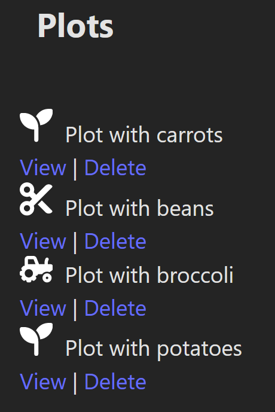
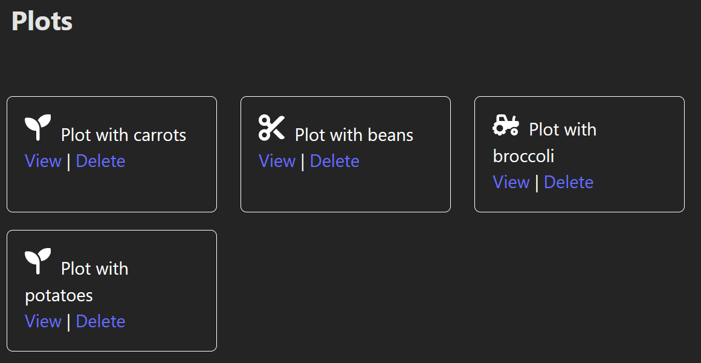
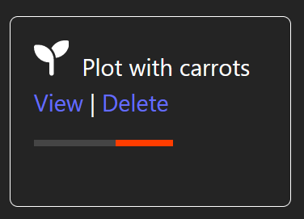
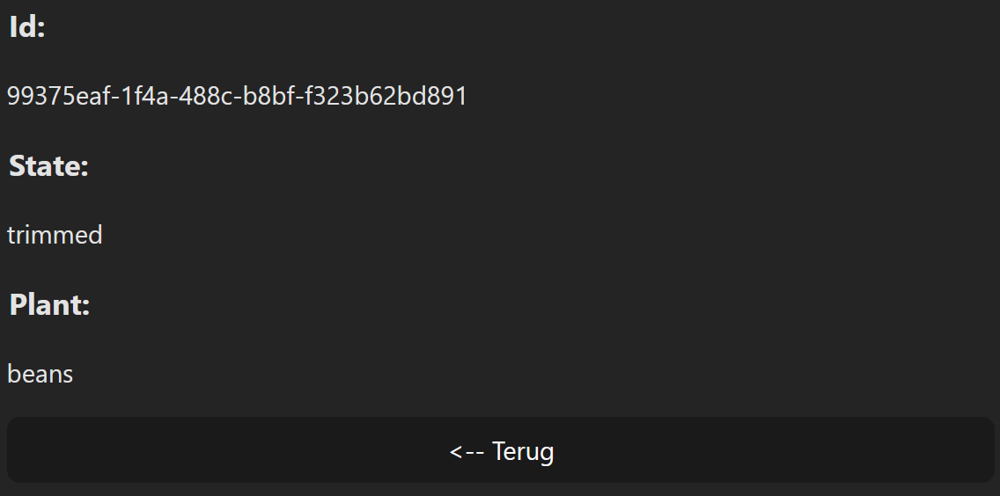
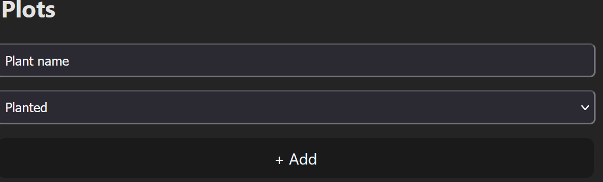
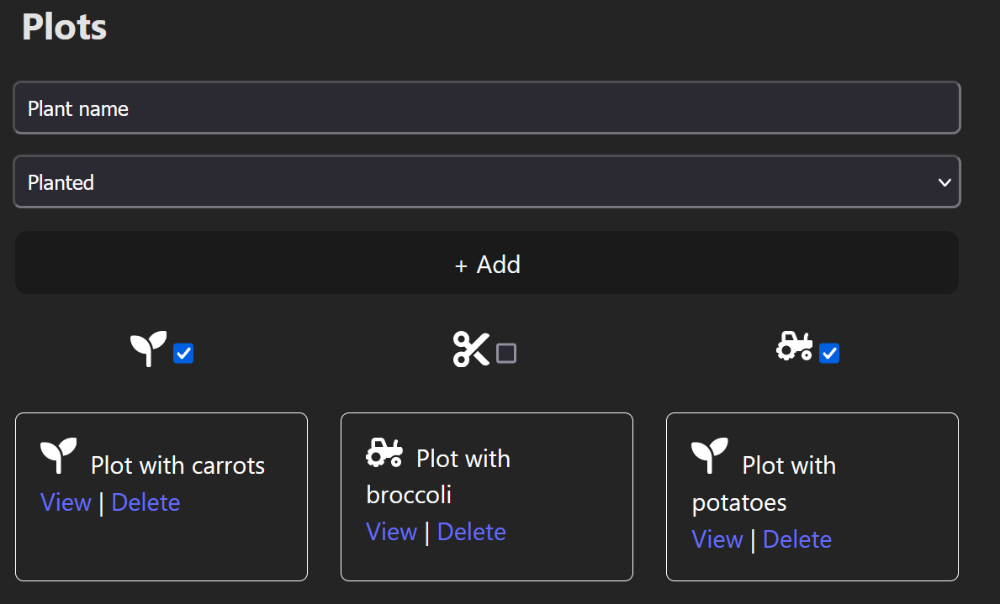
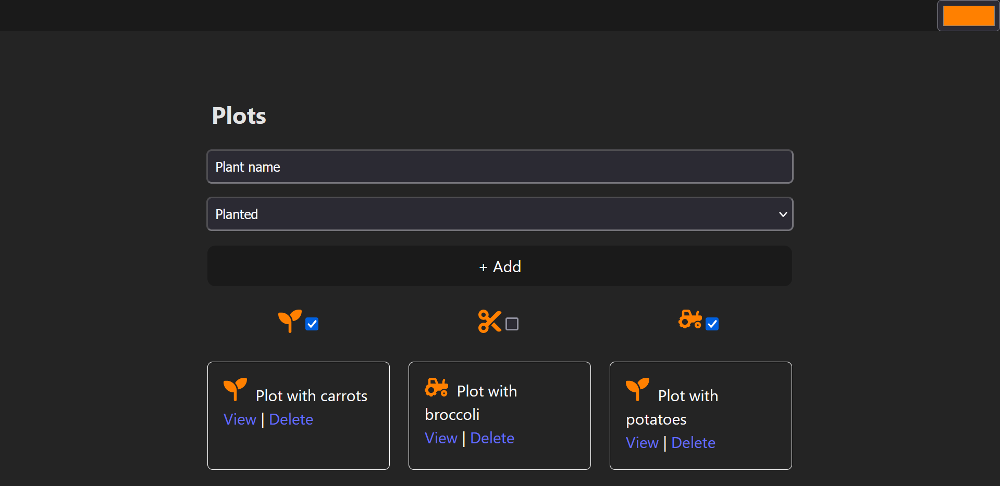

# Januari 2023 - 2024

Download "_Startbestanden.zip_".
Deze zip bevat twee submappen, één voor deel 1 en één voor deel 2.
Alle nodige libraries zijn al toegevoegd aan _package.json_, je moet dus enkel nog een `pnpm install` uitvoeren.

De startbestanden voor deel 1 worden gebruikt om je _React_ kennis te testen terwijl de bestanden voor deel 2 gebruikt
wordt om je kennis over Cypress te testen.
Hou de twee mappen afgezonderd, dit zijn twee aparte projecten en je zal dus ook twee keer het `pnpm install`
commando moeten uitvoeren.

**Voor sommige componenten is startcode gegeven waarin enkele properties voorzien zijn, deze properties zijn
NIET EXHAUSTIEF.
Het is dus mogelijk dat je aan de gegeven componenten nog properties moet toevoegen.**

**Dit is een **open-boek**, **open-internet** examen. 
Het enige wat niet toegestaan is, is het gebruik van (generative) AI en elke vorm van communicatie met iemand anders dan
je toezichter.**

## Deel 1: React

Tijdens dit examen bouw je een heel eenvoudige garden plannen, voor verschillende segmenten in een tuin kunnen de 
geplante gewassen bijgehouden worden en kan aangegeven worden of deze geplant, gesnoeid of geoogst zijn. 

### Startbestanden

De startbestanden bevatten een stylesheet met opmaak voor dit examen.
Zorg ervoor dat deze opmaak voor het volledige examen ingeladen wordt.
Let op, de startbestanden bevatten ook een bestand _cssForStyledComponents.txt_, dit zal je in een volgende opgaven als
bron moeten gebruiken, je kopieert deze code niet naar het CSS-bestand.

**In het verdere verloop van dit examen worden af en toe CSS-klassen vermeld die toegevoegd kunnen worden om de opmaak 
in de screenshots na te bouwen.
Als jouw oplossing er anders uitziet, is dit geen probleem.
De focus van het examen ligt op de functionaliteit, focus dus niet op CSS-problemen, deze hebben, behalve het koppelen
van de _.css_ file en het gebruik van styled-components geen invloed op je resultaat.**

**Alle CRUD-operaties moeten gebeuren door middel van TanStack (React) Query. 
Voor alternatieve oplossingen krijg je geen punten.**

### Navigatie & routing

Het react project bevat geen navigatiebalk, maar er moet wel routing voorzien worden. 
Er zijn twee routes beschikbaar, implementeer deze en zorg ervoor dat beide routes werken. 

* Het '/' pad toont de **Garden** component (te vinden in de startbestanden). 
* Het '/plot/id' pad toont de **PlotDetail** component (die nog aangemaakt moet worden) en bevat een dynamische 
  parameter `id` waarmee de details van een plot bekeken kunnen worden.  

Zorg ervoor dat elke pagina in de **Routing** component gebruik maakt van **Suspense**, terwijl de pagina aan het laden
is wordt de **LoadingPage** component gebruikt als fallback.
Deze component is te vinden in de startbestanden. 

### Overzicht plots

De **Garden** component renderd reeds de **PlotList** component.
Gebruik de _plotApi_ die je in de startbestanden vindt om, in de **PlotList** component, een overzicht te tonen van alle
plots.
Om een de informatie over een plot weer te geven kan je gebruik maken van de **Plot** component die al in de
startbestanden te vinden is. 

De **Plot** component bevat duidelijk nog geen opmaak, gebruik de CSS die je vindt in _cssForStyledComponents.txt_ om
rond elke individuele **Plot** component een _div_ container de plaatsen die de opmaak toevoegt.

### Plot verwijderen

Via de _Delete_ knop moet een plot verwijderd kunnen worden via een **afwachtende update**. 
Terwijl het plot verwijderd wordt, moet er de **LoadingPart** component uit de startbestanden getoond worden.

### Detailpagina

Via de _View_ knop moet de gebruiker naar de detailpagina kunnen navigeren, de opmaak voor deze pagina is reeds 
gegeven in de **DetailLayout** component.

Via de _<-- Terug_ knop met de gebruiker terug kunnen navigeren naar de vorige pagina **ongeacht hoe de gebruiker op 
de detailpagina geraakt is**. 
Je mag het pad _/_ dus niet hardcoderen.

### Plot aanmaken

Breid de **Garden** component uit met een formulier waarmee een nieuw plot toegevoegd kan worden. 
Dit formulier bestaat uit twee elementen, een text-input waarmee de naam van de plant aangegeven kan worden en een 
dropdown menu waarmee aangegeven kan worden wat de status van het plot is (gepland, geoogst, gesnoeid).

Nadat de gebruiker of de _+ Add_ knop gedrukt heeft moet het nieuwe plot toegevoegd worden via een 
**optimistische update**.

### Plots filteren

Breid de _PlotList_ component uit met een formulier waarmee de plots gefilterd kunnen worden op basis van de status.
De filters worden geïmplementeerd met een checkbox en kunnen dus gecombineerd worden om één, twee of alle drie de 
statussen te tonen. 

Om de icoontjes te tonen kan je gebruik maken van de **HarvestedIcon**, **PlantedIcon** en **TrimmedIcon** componenten
die beschikbaar zijn in de startbestanden.

### Context

Voeg bovenaan de pagina een nieuwe taakbalk toe met een color-picker (&lt;input type='color'&gt;).
Om de layout in onderstaand screenshot na te bouwen kan je de volledige **ColorPicker** component omringen met een 
_div_ die de klasse _color-picker_ krijgt.

De kleur die de gebruiker gekozen heeft moet bewaard worden via **context** en bepaald hoe de icoontjes in de rest van 
de pagina weergegeven worden. 
In onderstaand screenshot is via de **ColorPicker** component de kleur '#ff8000' gekozen die vervolgens gebruikt wordt 
om de kleur van de icoontjes aan te passen.

## Deel 2: Testing

De startbestanden bevatten reeds de nodige Cypress configuratie, inclusief de nodige commando’s.
Pas de Cypress environment variables aan voordat je testen begint te schrijven.
De startbestanden bevatten reeds de nodige data-cy properties.
Je mag er altijd extra toevoegen, maar normaal gezien is dit niet nodig.
De properties zijn de volgende:

*	_cinema-selector_: De knoppen waarmee de cinema's gefilterd kunnen worden. 
* _add-movie_: De knop waarmee en een nieuwe filter toegevoegd kan worden. 
* _movie_: De individuele films. 

### End-to-end testen

Schrijf onderstaand testscenario uit voor de ‘/’ route.
Eén van de onderstaande test slaagt standaard niet.
Pas de React code aan zodat deze wel slaagt, hiervoor moet je tussen de 1 - 5 lijnen code aanpassen of toevoegen.

*	Een niet-ingelogde gebruiker
  * Ziet exact 3 cinema filter knoppen.
  * Kan de films filteren op basis van de cinema, i.e. als de _Lier_ filter geselecteerd is mag geen van de films de 
    tekst _Geel_ of _Turnhout_ bevatten.
*	Een ingelogde gebruiker
  * Ziet de '+ Add Movie' knop en kan hierop klikken om exact één nieuwe film aan te maken. 
  *	Kan via de edit knop navigeren naar een nieuwe pagina, test dit door te controleren of de URL de string '_tt_' bevat.

